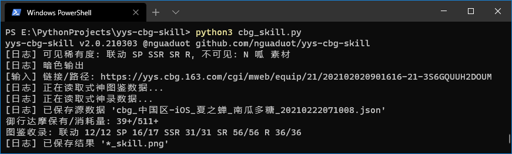

# 藏宝阁·阴阳师·技能图鉴

[](https://github.com/nguaduot/yys-cbg-skill)
[](https://github.com/nguaduot/yys-cbg-skill/releases)
[](dist/%E6%8A%80%E8%83%BD%E5%9B%BE%E9%89%B41.1.exe)

[阴阳师藏宝阁](https://yys.cbg.163.com/)衍生小工具，一图速览商品号式神图鉴&技能：

+ 按列展示各稀有度全部式神：**联动**、**SP**、**SSR**、**SR**、**R**
+ 以及其**技能**升级情况
+ **满技能**式神将高亮标记
+ 式神**缺失**也将高亮标记，并额外展示其**碎片**保有量
+ 页脚补充展示：
  + **御行达摩**保有量+消耗量
  + 式神图鉴**收录**情况

### 例

+ 支持解析藏宝阁商品号链接，例：

  
  
  
  
  输入商品链接：[https://yys.cbg.163.com/cgi/mweb/equip/21/202102020901616-21-3S6GQUUH2DOUM](https://yys.cbg.163.com/cgi/mweb/equip/21/202102020901616-21-3S6GQUUH2DOUM)
  
  输出结果图：[cbg_中国区-iOS_夏之蝉_南瓜多糖_20210222071008_skill.png](sample/cbg_中国区-iOS_夏之蝉_南瓜多糖_20210222071008_skill.png)

+ 也支持解析本地数据文件（来自「[痒痒熊快照](https://github.com/OnmyojiX/yyx)」），例：

  输入数据文件：[yyx_南瓜多糖_15007_438879_20210228052249.json](sample/yyx_南瓜多糖_15007_438879_20210228052249.json)
  
  输出结果图：[yyx_南瓜多糖_15007_438879_20210228052249_skill.png](sample/yyx_南瓜多糖_15007_438879_20210228052249_skill.png)

> 「技能图鉴」同时发布到 NGA 论坛阴阳师板块，可回复交流：
> 
> [https://nga.178.com/read.php?tid=25428203&_ff=538](https://nga.178.com/read.php?tid=25428203&_ff=538)

### 依赖

「技能图鉴」使用 Python3 编写，依赖的第三方库：

```
pip install pillow
```

### 文档

```
python3 cbg_skill.py -h
```

```
参数文档:
-u, --url        藏宝阁商品号链接/本地数据文件路径
-d, --dark       暗色输出(默认)
-l, --light      亮色输出
-v, --version    程序版本
-h, --help       帮助
```

### 作者

> “不会在记事本用 Python 写小工具的程序猿的不是好痒痒鼠！”
>
> —「夏之蝉」区@**南瓜多糖**

痒痒鼠相关问题欢迎来找我讨论，代码改进或漏洞也欢迎一起交流。

### 更新日志

v2.0.210301
+ 除藏宝阁链接，也支持解析本地藏宝阁JSON数据文件
+ 支持解析「[痒痒熊快照](https://github.com/OnmyojiX/yyx)」导出的JSON数据文件
+ 增加式神图鉴信息
+ 更精准识别SR、R阶联动拥有情况
+ 除暗色输出，增加亮色输出可选，并支持命令行指定（“-d/--dark”、“-l/--light”）

v1.1.210226
+ 缺失式神增加碎片收集量显示
+ 增加黑蛋保有量显示

v1.0.210205
+ 第一版发布